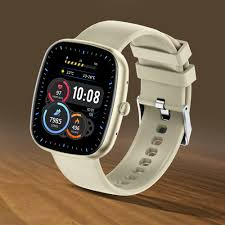
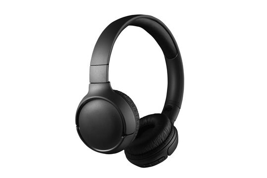
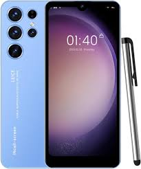

# Ex02 Commercial Website
## Date:

## AIM
To create a commercial website using CSS Flexbox.

## ALGORITHM
### STEP 1
Create an HTML file (index.html)

### STEP 2
Create a CSS file (style.css)

### STEP 3
Include a navigation bar with links to different sections.

### STEP 4
Add structured sections for Homepage, Products / Services, About Us, Contact Details and User Account.

### STEP 5
Include social media links at the footer with copyright information.

### STEP 6
Define global styles for fonts, colors, and layout.

### STEP 7
Style the header, navigation bar, and sections.

### STEP 8
Use Flexbox for layout design.

### STEP 9
Add hover effects and transitions for interactivity.

### STEP 10
Add Images and Media.

### STEP 11
Use optimized images for a professional look.

### STEP 12
Open the HTML file in a browser to check layout and functionality.

### STEP 13
Fix styling issues and refine content placement.

### STEP 14
Deploy the website.

### STEP 15
Upload to GitHub Pages for free hosting.

## PROGRAM

index.html 
~~~
<!DOCTYPE html>
<html lang="en">
<head>
    <meta charset="UTF-8">
    <meta name="viewport" content="width=device-width, initial-scale=1.0">
    <title>Commercial Website</title>
    <link rel="stylesheet" href="style.css">
</head>
<body>

    <!-- Navigation Bar -->
    <header>
        <nav class="navbar">
            <h1 class="logo">ShopEasy</h1>

            <ul class="nav-links">
                <li><a href="#">Home</a></li>
                <li><a href="#">Products</a></li>
                <li><a href="#">Offers</a></li>
                <li><a href="#">Contact</a></li>
            </ul>
        </nav>
    </header>

    <!-- Hero Section -->
    <section class="hero">
        <h2>Welcome to ShopEasy</h2>
        
Your One Stop Shopping Destination

        <button>Shop Now</button>
    </section>

    <!-- Product Section -->
    <section class="product-section">
        <h2 class="section-title">Featured Products</h2>

        

            

                
                <h3>Smart Watch</h3>
                
₹1999

            

            

                
                <h3>Headphones</h3>
                
₹1499

            

            

                
                <h3>Smart Phone</h3>
                
₹12999

            

        

    </section>

    <!--ABOUT US SECTION -->
    <section class="about">
        <h2>About Us</h2>
        

            Welcome to <strong>ShopEasy</strong>, your trusted online shopping destination.
            We provide high-quality products at affordable prices with a smooth and
            convenient shopping experience. 
            
        

    </section>

    <!-- CONTACT US SECTION -->
    <section class="contact">
        <h2>Contact Us</h2>
        
<strong>Email:</strong> support@shopeasy.com

        
<strong>Phone:</strong> +91 98765 43210

        
<strong>Address:</strong> Chennai, Tamil Nadu, India

    </section>

    <!-- FOOTER -->
    <footer>
        
Name: SAHANA S

        
Register Number: 212225230236

    </footer>

</body>
</html>
~~~

style.css
~~~
/* Reset */
*{
    margin:0;
    padding:0;
    box-sizing:border-box;
}

body{
    font-family: Arial, sans-serif;
    background: linear-gradient(135deg,#141e30,#243b55,#1a1a40);
    color:white;
    line-height:1.8;
}

/* Navbar */
.navbar{
    display:flex;
    justify-content:space-between;
    align-items:center;
    padding:20px 50px;
    background: rgba(0,0,0,0.4);
    backdrop-filter: blur(10px);
    box-shadow:0 4px 12px rgba(0,0,0,0.4);
}

.logo{
    font-size:32px;
    color:#ffcc00;
}

.nav-links{
    display:flex;
    list-style:none;
    gap:30px;
}

.nav-links a{
    text-decoration:none;
    color:white;
    font-size:18px;
    transition:0.3s;
}

.nav-links a:hover{
    color:#00f7ff;
}

/* Hero Section */
.hero{
    text-align:center;
    padding:110px 20px;
    background: linear-gradient(135deg,#7f00ff,#e100ff,#00c6ff);
}

.hero h2{
    font-size:50px;
    margin-bottom:25px;
}

.hero p{
    font-size:24px;
    margin-bottom:35px;
    color:#f3f3f3;
}

.hero button{
    padding:15px 35px;
    border:none;
    border-radius:30px;
    background: linear-gradient(to right,#ffcc00,#ff6600);
    color:white;
    font-size:18px;
    font-weight:bold;
    cursor:pointer;
    transition:0.3s;
}

.hero button:hover{
    transform:scale(1.05);
}

/* Product Section */
.product-section{
    padding:90px 50px;
}

.section-title{
    text-align:center;
    font-size:38px;
    margin-bottom:55px;
    color:#00f7ff;
}

/* Flexbox Products */
.products{
    display:flex;
    justify-content:center;
    flex-wrap:wrap;
    gap:35px;
}

/* Cards */
.card{
    width:280px;
    background: linear-gradient(145deg,#232526,#414345);
    border-radius:20px;
    padding:20px;
    text-align:center;
    box-shadow:0 6px 18px rgba(0,0,0,0.4);
    transition:0.4s;
}

.card:hover{
    transform:translateY(-12px);
}

.card img{
    width:100%;
    height:250px;
    object-fit:cover;
    border-radius:15px;
}

.card h3{
    margin-top:20px;
    margin-bottom:10px;
    color:#ffcc00;
}

.card p{
    color:#00ffcc;
    font-size:20px;
    font-weight:bold;
}

/* Different Card Colors */
.card:nth-child(1){
    border-top:6px solid #ff4d6d;
}

.card:nth-child(2){
    border-top:6px solid #00f7ff;
}

.card:nth-child(3){
    border-top:6px solid #ffcc00;
}

/* Footer */
footer{
    background: linear-gradient(to right,#0f2027,#203a43,#2c5364);
    text-align:center;
    padding:35px;
    margin-top:60px;
    line-height:2;
    font-size:18px;
}

/* Responsive */
@media(max-width:768px){

    .navbar{
        flex-direction:column;
        gap:20px;
    }

    .nav-links{
        flex-direction:column;
        text-align:center;
    }

    .hero h2{
        font-size:38px;
    }

    .hero p{
        font-size:20px;
    }

    .products{
        flex-direction:column;
        align-items:center;
    }
}
/* About & Contact Section */

.about, .contact{
    width:85%;
    margin:50px auto;
    padding:40px;
    border-radius:20px;
    background: rgba(255,255,255,0.08);
    backdrop-filter: blur(10px);
    box-shadow:0 4px 15px rgba(0,0,0,0.3);
    text-align:center;
}

.about h2,
.contact h2{
    font-size:36px;
    margin-bottom:20px;
    color:#ffcc00;
}

.about p,
.contact p{
    font-size:18px;
    line-height:2;
    color:#f1f1f1;
}
~~~

## OUTPUT

## RESULT
The program for creating commercial website using CSS Flexbox is executed successfully.
